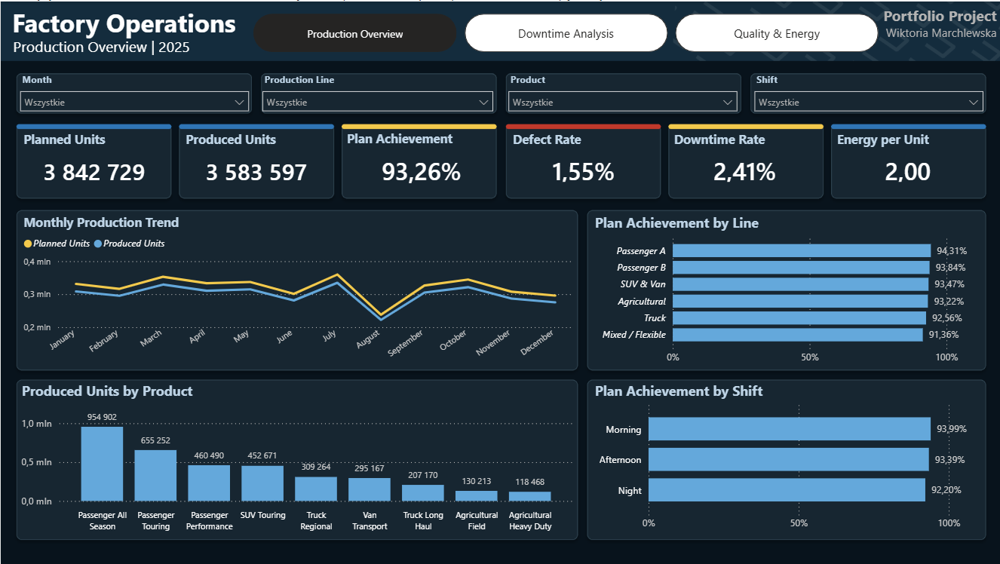
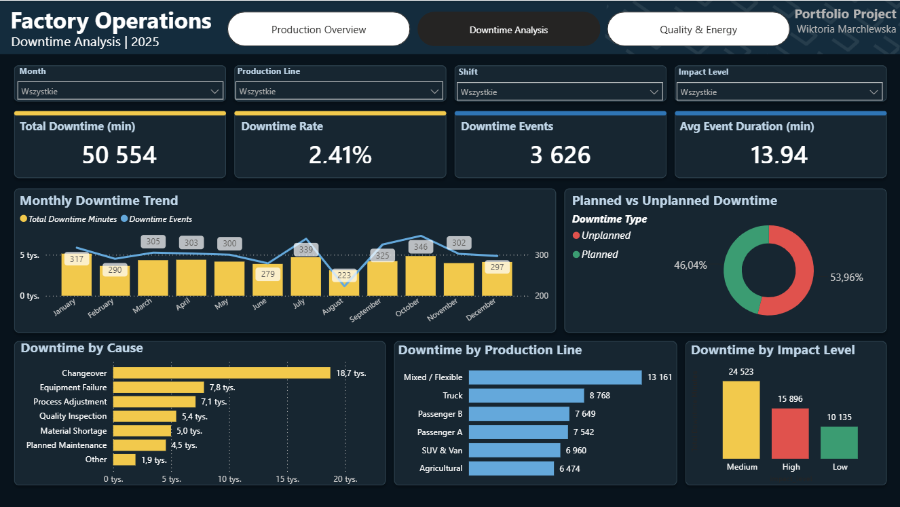
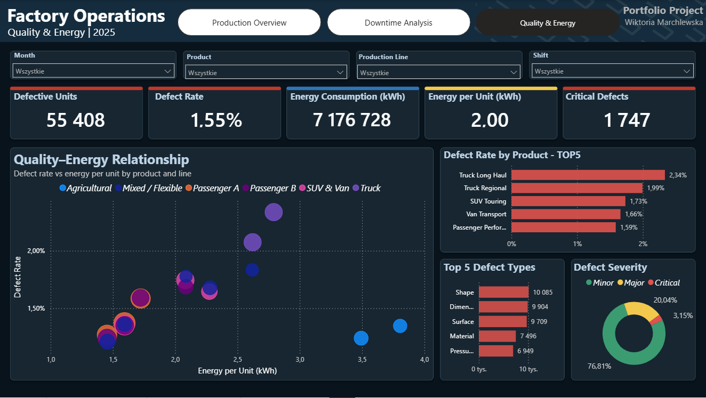

# Factory Operations Analysis

End-to-end portfolio project presenting the analysis of a fictional tire manufacturing plant. The project combines a relational MySQL/MariaDB database, SQL analysis, data modelling, DAX measures and an interactive Power BI dashboard.

> The dataset is synthetic and was created exclusively for educational and portfolio purposes. The project is not affiliated with any real company.

## Dashboard preview

### Production Overview



### Downtime Analysis



### Quality & Energy



## Business objective

The purpose of the project was to create a realistic manufacturing analysis that helps answer questions such as:

- Is the production plan being achieved?
- Which production lines, products and shifts perform best?
- What are the main causes of downtime?
- What proportion of downtime is planned and unplanned?
- Which products and defect types have the greatest quality impact?
- How does energy consumption relate to production quality?

## Tools used

- **MySQL / MariaDB** — relational database and analytical queries
- **phpMyAdmin and XAMPP** — local database environment and data import
- **Power Query** — data preparation and data type validation
- **Power BI** — data model, visualisations and interactive report
- **DAX** — business measures and KPI calculations

## Data model

The model follows a star-schema-style structure and contains five dimension tables and three fact tables.

### Dimension tables

- `dim_date` — calendar attributes and production closure information
- `dim_time_interval` — production time slots
- `dim_line` — production lines and their operating characteristics
- `dim_product` — product groups, expected defect rates and energy parameters
- `dim_shift` — production shifts and performance modifiers

### Fact tables

- `fact_production` — planned and produced units, production status and microstops
- `fact_downtime` — downtime events, duration, cause and impact level
- `fact_defect` — defective units, defect types and severity

The tables are connected using primary and foreign keys. Dimension tables filter the fact tables by date, time, production line, product and shift.

## Main KPIs

| KPI | Result |
|---|---:|
| Planned Units | 3,842,729 |
| Produced Units | 3,583,597 |
| Production Plan Achievement | 93.26% |
| Defective Units | 55,408 |
| Defect Rate | 1.55% |
| Total Downtime | 50,554 min |
| Downtime Rate | 2.41% |
| Energy Consumption | 7,176,728.03 kWh |
| Energy per Unit | 2.00 kWh |
| Critical Defects | 1,747 |

## Dashboard pages

### 1. Production Overview

Provides a high-level view of production performance, including planned and produced units, plan achievement, defect rate, downtime rate and energy per unit. It also compares results by month, production line, product and shift.

### 2. Downtime Analysis

Focuses on downtime duration and event frequency. It presents monthly trends, planned versus unplanned downtime, the main downtime causes, differences between production lines and downtime impact levels.

### 3. Quality & Energy

Combines product quality and energy indicators. It includes defect rate, defective units, critical defects, energy consumption, energy per unit, the five products with the highest defect rate and the five defect types with the greatest impact.

## Selected DAX measures

The Power BI report uses measures including:

- Planned Units
- Produced Units
- Production Plan Achievement %
- Defective Units
- Defect Rate %
- Total Downtime Minutes
- Downtime Rate %
- Downtime Events
- Average Downtime per Event
- Energy Consumption kWh
- Energy per Unit kWh
- Critical Defects

Example measure:

```DAX
Production Plan Achievement % =
DIVIDE(
    [Produced Units],
    [Planned Units],
    0
)
```

## Key observations

- Overall production plan achievement reached **93.26%**, indicating a consistent gap between planned and actual output.
- The morning shift achieved the strongest result, while the night shift recorded the lowest plan achievement.
- Unplanned downtime represented **53.96%** of total downtime, compared with **46.04%** for planned downtime.
- Critical defects accounted for approximately **3.15%** of defective units; most defects were classified as minor.
- The dashboard enables additional comparisons using synchronized month, production line, product and shift filters.

## Repository structure

```text
factory-operations-analysis/
|-- README.md
|-- dashboard/
|   `-- Factory_Operations_Analysis.pbix
|-- data/
|   |-- dim_date.csv
|   |-- dim_time_interval.csv
|   |-- dim_line.csv
|   |-- dim_product.csv
|   |-- dim_shift.csv
|   |-- fact_production.csv
|   |-- fact_downtime.csv
|   `-- fact_defect.csv
|-- images/
|   |-- production_overview.png
|   |-- downtime_analysis.png
|   `-- quality_energy.png
`-- sql/
    |-- database_schema.sql
    `-- analysis_queries.sql
```

## How to reproduce the project

1. Create the database by running `sql/database_schema.sql` in MySQL or MariaDB.
2. Import the CSV files from the `data` folder into the corresponding tables. Import dimension tables before fact tables to preserve foreign-key integrity.
3. Run the queries contained in `sql/analysis_queries.sql` to review and validate the main analytical results.
4. Open `dashboard/Factory_Operations_Analysis.pbix` in Power BI Desktop.
5. If necessary, update the local database connection in Power Query and refresh the report.

## Author

**Wiktoria Marchlewska**  
Portfolio project — SQL, data modelling and Power BI
